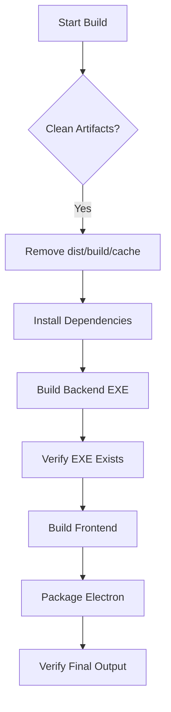
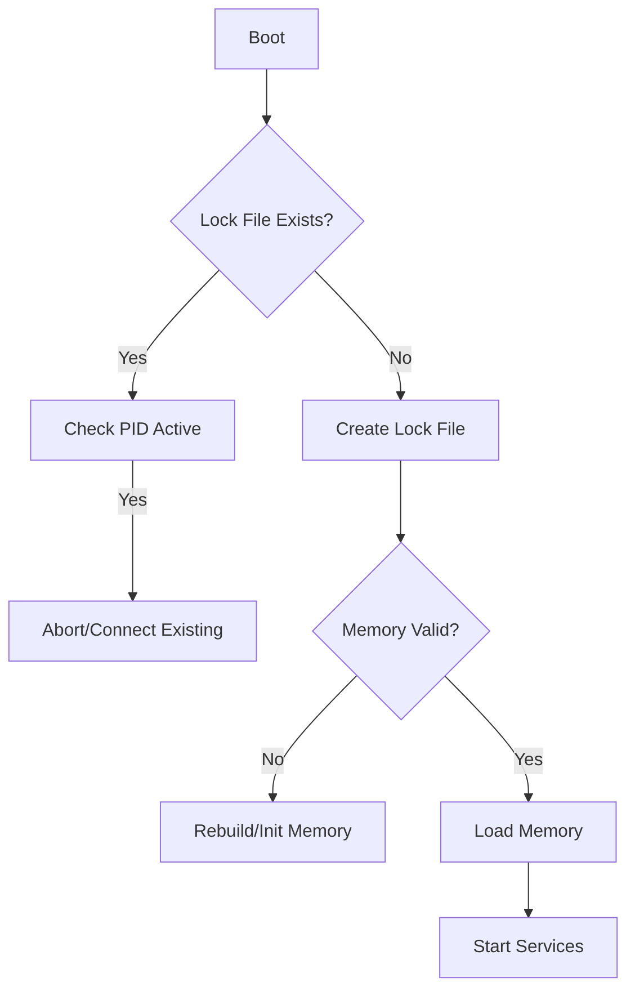

# Idempotency & Determinism Audit Report

## 1. Idempotency Logic Overview

### System: Build Pipeline
The build pipeline (`build_backend.bat`, `build.py`, `electron-builder.yml`) currently has partial clean-up logic.
**Logic Model:** "Clean-Replace-Verify"
- **Clean:** Explicitly remove `dist`, `build`, `win-unpacked` before starting.
- **Replace:** Always overwrite `titan_backend.exe` in the staging area.
- **Verify:** Check for file existence after build steps.
**Gap:** `build_backend.bat` relies on `if exist` checks for Python but doesn't verify `pip install` state effectively (re-runs every time). It deletes `dist` but might leave stale `__pycache__`.

### System: Backend Runtime
The backend (`boot_sequence.py`, `main.py`) handles initialization.
**Logic Model:** "Check-Init-Load"
- **Check:** Detects USB drive or local data.
- **Init:** Creates `memory.json` if missing.
- **Load:** Loads state into memory.
**Gap:** `initialize_titan_data` only checks `if not memory_file.exists()`. If the file exists but is corrupt (e.g. 0 bytes), it might crash or behave unpredictably. No lock file mechanism visible to prevent double-boot.

### System: Memory Subsystem
The memory system (`memory_v4.py`) manages persistence.
**Logic Model:** "Append-Index-Retrieve"
- **Append:** Writes to `.jsonl` (robust against crashes).
- **Index:** Adds to ChromaDB if available.
- **Retrieve:** Hybrid search.
**Gap:** `_setup_vector_db` creates collection `get_or_create_collection`. If the collection exists but is out of sync with JSONL, it doesn't repair it. Idempotency risk: re-indexing the same data if the ID logic isn't strictly deterministic or if the DB persists while JSONL is wiped (or vice versa). MD5 hash of content + timestamp is good for uniqueness but sensitive to millisecond differences on re-runs of *same inputs* if not careful.

### System: Frontend
(Audit pending detailed code read, assumed from `list_files`)
**Logic Model:** "Mount-Fetch-Render"
**Gap:** React `useEffect` hooks often fire twice in Strict Mode (dev) or on re-mounts. Risk of double-initialization of IPC listeners or timers.

### System: CPU-Only / Offline Mode
**Logic Model:** "Detect-Fallback"
**Gap:** `memory_v4.py` checks `HAS_CHROMA` and `HAS_TRANSFORMERS`. If they fail to import, it sets flags. Logic seems present but needs verification that `_local_semantic_search` falls back gracefully without hanging.

---

## 2. State Tracking Mechanism

### Component: Build Pipeline
- **State Storage:** File system existence (`dist/titan_backend.exe`).
- **Check Method:** `if exist` checks in batch scripts.
- **Skip Condition:** None implemented (always rebuilds). **Improvement:** Start fresh every time is actually safer for builds (Zero State), so "Skip" is not desired here, but "Clean" is critical.

### Component: Backend Boot
- **State Storage:** `titan_data/memory/memory.json`.
- **Check Method:** `pathlib.Path.exists()`.
- **Skip Condition:** If file exists, skip creation.
- **Risk:** No verification of file validity.

### Component: Memory Index
- **State Storage:** ChromaDB (sqlite/parquet) + `memory_v4.jsonl`.
- **Check Method:** `get_or_create_collection`.
- **Skip Condition:** Chroma handles existence check.
- **Risk:** Desync between JSONL and VectorDB.

---

## 3. Idempotent Execution Flow (Planned)

### Build Pipeline Flow

### Backend Boot Flow

---

## 4. Proposed Changes (Summary)

1.  **Build Scripts:** Ensure `build.py` and `build_backend.bat` aggressively clean *all* potential artifacts (`__pycache__`, `.spec` files) before starting to guarantee determinism.
2.  **Backend Boot:** Add a "Lock File" or "PID File" check to `boot_sequence.py` to prevent multiple backend instances from stomping on state. Add validation for `memory.json` (load and catch JSONDecodeError -> backup and reset).
3.  **Memory:** In `memory_v4.py`, add a startup consistency check. count(JSONL lines) vs count(Chroma collection). If significantly different, trigger re-index (or log warning). Ensure `generate_id` is deterministic based on content if possible, or accept timestamp-based if inputs vary.
4.  **Frontend:** Review `App.jsx` and `boot` components to ensure `useEffect` hooks have cleanup functions.

## 5. Success State Definitions

-   **Build:** Output folder contains exactly one set of installers. No temp folders remain.
-   **Backend:** `titan_backend.exe` running (1 instance). `titan.lock` exists. `memory.json` is valid JSON.
-   **Memory:** `memory_v4.jsonl` exists. Vector store accessible (or graceful fallback logged).

## 6. Verification Checklist

-   [ ] Run `build.py` twice. Resulting binaries should have identical behavior (hash might differ due to timestamps, but file structure identical).
-   [ ] Delete `memory.json` -> Backend creates fresh one.
-   [ ] Corrupt `memory.json` (add garbage) -> Backend detects, backs up `memory.corrupt`, creates fresh one.
-   [ ] Disconnect Internet -> Memory system falls back to keyword search without crashing.
